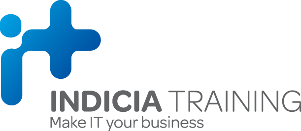

# PHP Security

## Setup

-   Run `composer install` and `npm install`
-   Copy the `.env.example` to `.env`
-   Run `php artisan key:generate`
-   Run `php artisan migrate`
-   Run `npm run dev` in one terminal
-   Run `php artisan serve` in another

## Notes

This repo will grow over the course of the time we have together (and possibly after).

I'll try hard not to change any files that you might be working in once shared to avoid merge conflicts.

The aim is for this repo to contain both the notes and the examples that will be used in our training.

## Timings

-   09.30 - 11.00 - Session 1
-   11.00 - 11.15 - Coffee
-   11.15 - 12.45 - Session 2
-   12.45 - 13.45 - Lunch
-   13.45 - 15.15 - Session 3
-   15.15 - 15.30 - Coffee
-   15.30 - 16.30 - Session 4

### Miro board

https://miro.com/app/board/uXjVKUIjPHo=/?share_link_id=843302215879

### Feedback link:

## Outline

This is the prepared outline for the three days. We can add and remove elements as you feel necessary.

### Day 1:

-   Introduction to Application Security and asking `Is PHP insecure?`
-   Threat modelling and Risk Analysis
-   Input validation
-   XSS

### Day 2:

-   Security headers
-   Incident Response and Logging
-   Static Analysis
-   SQL Injection

### Day 3:

-   AWS security
-   GDPR and Data Protection
-   Cross-Origin Resource Sharing (CORS)
-   Cookies in Laravel
-   Using Cypress to Test for Security Vulnerabilities
-   CI/CD with a Security Focus
-   CSRF in Laravel
-   DDOS Protection and Rate Limiting
-   Final Security Thoughts

## After the course

If you have any further questions, feel free to reach out to me through my website (https://kevincunningham.co.uk) or by email (questions@kevincunningham.co.uk)
